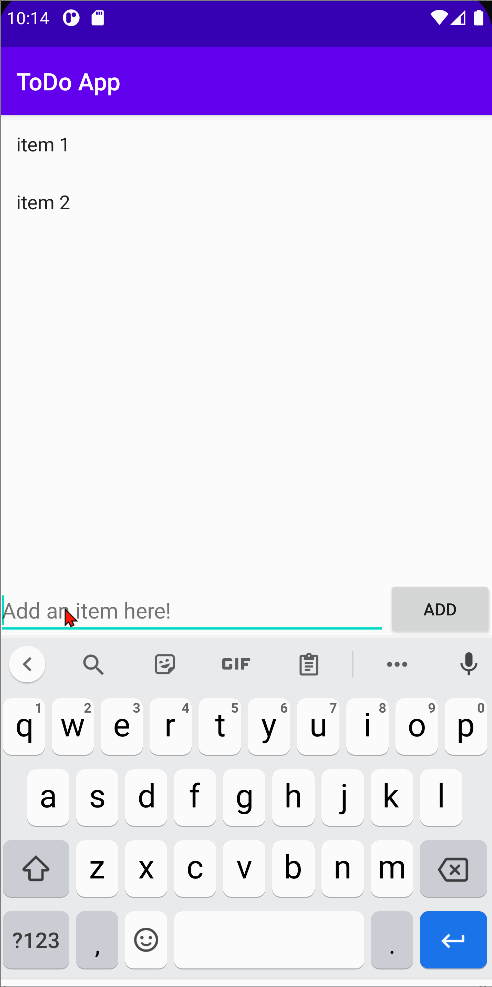

# SampleTodo
Simple Todo app for CodePath

# Project 1 - *Sample Todo*

**Sample Todo** is an android app that allows building a todo list and basic todo items management functionality including adding new items, editing and deleting an existing item.

Submitted by: **Zhuohao Tan**

Time spent: **4** hours spent in total

## User Stories

The following **required** functionality is completed:

* [x] User can **view a list of todo items**
* [x] User can **successfully add and remove items** from the todo list
* [x] User's **list of items persisted** upon modification and and retrieved properly on app restart

The following **optional** features are implemented:

* [ ] User can **tap a todo item in the list and bring up an edit screen for the todo item** and then have any changes to the text reflected in the todo list

The following **additional** features are implemented:

* [ ] User can customize their Todo app skins
* [ ] User can set deadlines for their todo items
* [ ] User can receive notification when the deadlines is almost meet

## Video Walkthrough

Here's a walkthrough of implemented user stories:

GIF created with [LiceCap](http://www.cockos.com/licecap/).

## Notes

The followings are some challenges that I had spent a lot of time overcoming.

1. Since I used a different version of Java. When I was typing the same things as the instruction in the video, I keep getting errors.

2. Some misspellings also caused a lot of errors in my project.

3. The debugging process was annoying, and I have to be patient in order to figure out all the bugs.

However, I think the project is exciting overall. I do enjoy working on this project and trying to understand every step in the instruction video.

## License

    Copyright [2021] [Zhuohao Tan]

    Licensed under the Apache License, Version 2.0 (the "License");
    you may not use this file except in compliance with the License.
    You may obtain a copy of the License at

        http://www.apache.org/licenses/LICENSE-2.0

    Unless required by applicable law or agreed to in writing, software
    distributed under the License is distributed on an "AS IS" BASIS,
    WITHOUT WARRANTIES OR CONDITIONS OF ANY KIND, either express or implied.
    See the License for the specific language governing permissions and
    limitations under the License.
